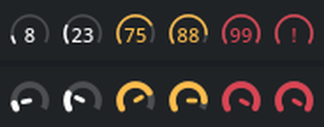
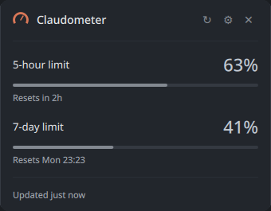
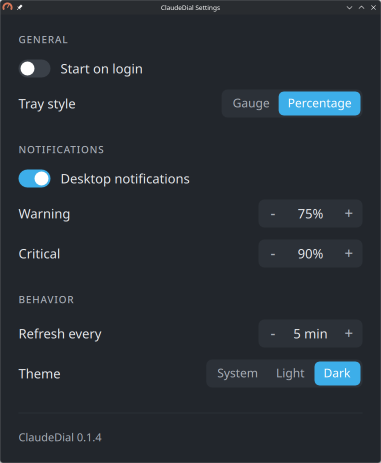
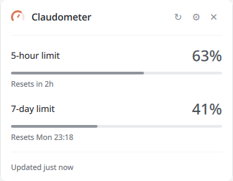
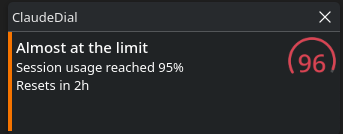

# ClaudeDial

**Claude Code usage at a glance.**

A minimal Linux system tray indicator for Claude Code usage limits.
Glance at the icon, hover for details, click for a small popup, forget about it.



That is the tray icon at 8%, 23%, 75%, 88%, 99% and at the limit - the exact
figure on top, the needle below. Same dial, two styles. Click it:



It is not an analytics dashboard, and is not going to become one. No graphs, no
token history, no accounts, no telemetry, no cloud backend.

## Please read this before installing


Two things you are entitled to know up front.

**1. ClaudeDial reads Claude Code's credential file.** It needs the OAuth access
token Claude Code stores at `~/.claude/.credentials.json` in order to ask
Anthropic what your usage is. It opens that file read-only, holds the token in
exactly one class, sends it only to `api.anthropic.com` over HTTPS - an address
hard-coded at build time, not configurable - and never logs it,
copies it, exposes it to the UI layer, or writes it anywhere.

It also **never refreshes the token**, which is a deliberate limitation rather
than an oversight: Anthropic rotates the refresh token on use, so refreshing
here would race Claude Code and could sign you out of it. Instead, ClaudeDial
watches the file and picks up whatever Claude Code refreshes. In practice, if
you use Claude Code daily the token stays alive for free; if you have not run it
in a while, ClaudeDial shows you stale data and says so.

**2. The usage endpoint is undocumented.** ClaudeDial reads
`GET api.anthropic.com/api/oauth/usage`, which is not part of Anthropic's public
API and is annotated *"Experimental - the response shape may change"* by Claude
Code's own internal schema. It can change or disappear without notice. When it
does, ClaudeDial degrades to showing stale data rather than crashing or lying.

ClaudeDial is an unofficial tool. It is not endorsed by or affiliated with
Anthropic.

Full write-up, including the exact request, the response shape, and the security
rules the code follows: [docs/usage-api.md](docs/usage-api.md). How the code is
put together: [docs/architecture.md](docs/architecture.md).

## Installation

Two artefacts are published for each release, plus a source build.

### AppImage

Self-contained: it carries Qt and OpenSSL, so it needs nothing but a Linux with
a graphical session.

```console
$ chmod +x ClaudeDial-x86_64.AppImage
$ ./ClaudeDial-x86_64.AppImage
```

Take v0.1.2 or later. The AppImages attached to v0.1.0 and v0.1.1 were built
without the Qt Wayland platform plugin: the tray icon appears but the popup does
not, and they need `QT_QPA_PLATFORM=xcb` to be usable.

### Tarball

`claudedial-<version>-linux-x86_64.tar.gz` from the same release is a hundred
times smaller, because it links your distribution's Qt rather than shipping its
own. Unpack it over `/usr` or `~/.local`.

### Arch Linux

Not in the AUR yet: account registration there is paused while they deal with a
wave of automated signups. The package is ready regardless, so build it from
this repository instead.

```console
$ curl -fLo PKGBUILD https://raw.githubusercontent.com/MarvinParanoid/ClaudeDial/main/packaging/PKGBUILD-bin
$ makepkg -si
```

That file is what the AUR package will be, unchanged: it unpacks the tarball
above rather than compiling, so the build takes seconds and links your system
Qt. Pacman then owns the files, which is the point - `pacman -R claudedial-bin`
removes it cleanly. New versions need the two commands again until the AUR
package lands and `yay -S claudedial-bin` starts working.

### From source

See [Building](#building).

## Status bar integration


ClaudeDial is also a one-shot CLI, so Waybar, Polybar, i3blocks, Conky and
plain scripts can use it without the tray.

```console
$ claudedial --json
{
    "five_hour": { "usage": 10, "reset_at": "2026-09-03T21:30:00Z" },
    "seven_day": { "usage": 27, "reset_at": "2026-09-08T04:00:00Z" },
    "updated_at": "2026-09-03T18:17:54Z",
    "stale": false,
    "text": "10%",
    "tooltip": "ClaudeDial\n5h  10% · resets in 3h 12m\n7d  27% · resets in 4d 9h",
    "class": "normal"
}
```

`text`, `tooltip` and `class` are what Waybar's `return-type: json` expects, so a
module needs no wrapper script:

```jsonc
"custom/claude": {
    "exec": "claudedial --json",
    "return-type": "json",
    "interval": 300,
    "on-click": "claudedial"
}
```

`class` is one of `normal`, `warning`, `critical`, `severe`, `limit`, `stale`,
`unavailable` - style them in your Waybar CSS. The output carries percentages
and timestamps only: no token, no organisation id, nothing identifying, because
status-bar configs end up in public dotfiles repos.

`claudedial --once` prints the same thing for humans. Both run without a
display, so they work over SSH and from a startup script before the compositor
is up.

**Polling `--json` is free while the tray is running.** The rate-limit bucket is
per access token, so a status bar on its own timer and the tray on its would
otherwise consume it twice over. A one-shot invocation asks the running instance
for its last result over a local socket and only reaches for the network when
nothing is running - so a Waybar `interval` costs nothing, and returns instantly.

## Desktop support


Developed on Arch with KDE Plasma on Wayland; built to work beyond it.

| Desktop | Works via | Notes |
| --- | --- | --- |
| KDE Plasma | tray icon, popup, tooltip | the desktop this was developed and tested on |
| Xfce, Cinnamon, MATE, LXQt | tray icon, popup, tooltip | StatusNotifierItem; not yet verified by anyone |
| GNOME | tray icon and menu | needs the [AppIndicator extension][appind]; a left click opens the menu, so use **Show usage** or double-click. No tooltips on AppIndicator |
| Sway, Hyprland, i3 | `claudedial --json` | a text status bar needs no tray at all |
| Windows, macOS | — | Qt supports them; nobody has tried |

Only the first row has been verified. The rest follows from the protocols
involved, which is not the same thing — see
[docs/platform-support.md](docs/platform-support.md) for what is guaranteed,
what is attempted, and what ClaudeDial declines to do.

[appind]: https://github.com/ubuntu/gnome-shell-extension-appindicator

The tray uses StatusNotifierItem over D-Bus, via `QSystemTrayIcon` - which means
it works on Plasma out of the box, and on GNOME with the AppIndicator extension.
Notifications use `org.freedesktop.Notifications`. Autostart is a normal XDG
entry in `~/.config/autostart`. Refresh-on-resume uses logind's `PrepareForSleep`.

Two known Wayland limitations that ClaudeDial cannot work around reliably:

- **The popup's position is chosen by the compositor.** A Wayland client cannot
  place its own top-level windows, so `setPosition()` is ignored and the popup
  appears wherever the compositor decides - typically near the middle of the
  screen. ClaudeDial asks the panel where its icon is and anchors to it when it
  gets an answer, but StatusNotifierItem hosts generally do not report icon
  geometry; Plasma does not. (The anchoring path is exercised only by a legacy
  XEmbed tray on X11, and is untested.)

  **Drag the popup by its header** to move it - that goes through the compositor
  and works on Wayland. On Plasma you can make the position stick with a window
  rule: System Settings → Window Management → Window Rules, match window class
  `claudedial` and window title `ClaudeDial`, then set Position to force the
  corner you want. Match the title as well as the class, or the rule will also
  catch the settings window.
- **The popup may not receive keyboard focus**, in which case it will not
  dismiss itself when you click elsewhere. Clicking the tray icon again, or the
  close button, always works.

## Settings




Right-click the tray icon for **Show usage**, **Refresh now**, **Settings** and
**Quit**, or use the gear in the popup.

"Show usage" is in that menu for a reason: on GNOME, where the tray comes from
the AppIndicator extension, a single left click opens the menu rather than
activating the icon, so the menu is the only route to the popup. A double click
opens it there too. On Plasma a single click toggles it, as you would expect.

Start on login, refresh interval, notifications, warning and critical
thresholds, tray style, tray icon tone, and theme (system / light / dark) are
all configurable.
Settings live in `~/.config/claudedial/claudedial.conf`; the `[state]` group in
that file is ClaudeDial's own bookkeeping, not settings.

**Tray style** picks what goes inside the ClaudeDial arc:

- **Percentage** (default) - the exact 5-hour figure. Answers the question with
  no hover and nothing to interpret, which is what a tray indicator is for. At
  100% it shows `!`, because three digits are not legible at typical tray-icon
  sizes and the tooltip still gives you the number.
- **Gauge** - the needle. A reading you take in at a glance as little / half /
  nearly all, with the exact figure a hover away.

The arc is the same in both and fills with usage either way, so they are two
styles of one dial rather than two icons. The popup header always shows the
needle, as the constant logotype.

**Tray icon** sets how light or dark the icon is drawn while usage is below the
warning threshold. **Auto** follows your application colours, which is right
when your panel matches them. Pick **Light** for a dark panel or **Dark** for a
light one when it does not: a panel cannot be asked what colour it is, and on
KDE it is a separate setting from the application colour scheme - Breeze
Twilight pairs light applications with a dark panel. Above the warning
threshold the icon is amber, orange or red regardless, which is legible either
way.

When the data is stale the whole mark fades, so a glance at the panel tells you
the number is the last one ClaudeDial managed to fetch.

Under the 5-hour row there is one more line, `Usage 63% · window 60%`. A
percentage alone says how much is spent but not whether that is a lot: 63% with
four hours still to run is heavy, 63% with forty minutes left is fine. The two
numbers sit side by side so you can compare them and draw your own conclusion -
there is no pace multiplier, no projection and no verdict. The 7-day window does
not get this: consumption across days is naturally uneven, so "40% through the
week" would say nothing useful.

That line is experimental. If nobody's eye ever catches it, it will go.

Colour has three separate jobs:

| Role | Meaning |
| --- | --- |
| **Terracotta** | ClaudeDial's identity - the application icon and the popup's header mark |
| **Your Plasma accent** | interactive controls, so they match the rest of your desktop |
| **neutral → amber → orange → red** | how much of a limit is spent |

The usage ramp steps at your warning threshold, your critical threshold, 95% and
100% - the same points the notifications fire on. The tray icon stays monochrome
below the warning threshold, because a panel icon is on screen permanently and
should not be a standing splash of colour.

Both themes are drawn from the popup's own palette rather than the desktop's,
which is what lets Light and Dark work even on a desktop whose platform theme
declines to switch:



Why any of it looks the way it does, and what was tried and rejected:
[docs/design.md](docs/design.md).

## Notifications




Once per window at 75%, 90%, 95% and 100%, reset when the window does - and not
re-announced after a restart. The title says how bad it is, the first line says
which threshold was crossed, and the second gives the reset time, which is the
part you do not already have from the title and the icon. (The icon shows the
*current* figure, so it can read 96 on a banner about crossing 95%.)

The icon travels with the notification as pixels rather than as an icon name.
A name only resolves once ClaudeDial is installed into an icon theme, and until
then the daemon draws a blank document, which makes the banner look broken.

## Refresh behaviour


Every 5 minutes by default, and on start, on manual refresh, when Claude Code
refreshes its token, and after waking from suspend. The interval floor is 60
seconds on purpose: the rate-limit bucket is per access token and shared with
any other usage monitor you run, and this endpoint does return 429 if you push
it. A failure never clears good data - the last known usage stays on screen,
marked stale.

## If TLS fails from the AppImage


The AppImage bundles OpenSSL, because distributions ship incompatible versions
of it and ClaudeDial makes one HTTPS request. On a host whose own OpenSSL
configuration disagrees with the bundled library, that can break instead of
help; the escape hatch is to neutralise the host configuration for this process:

```console
$ OPENSSL_CONF= ./ClaudeDial-x86_64.AppImage
```

## Building


Needs Qt 6.8+, CMake 3.21+ and a C++20 compiler. No other runtime dependencies -
no Electron, no webview, no Python, no Node.

6.8 rather than something older because `QStyleHints::setColorScheme()`, which
is the whole Light/Dark setting, arrived there; `QPalette::Accent`, which is how
the settings window follows your desktop's accent colour, arrived in 6.6. Qt Svg
is needed for the application icon.

```console
$ cmake -S . -B build -G Ninja -DCMAKE_BUILD_TYPE=Release
$ cmake --build build
$ ctest --test-dir build
$ sudo cmake --install build
```

On Arch: `pacman -S qt6-base qt6-declarative qt6-svg cmake ninja`.

## Development

`--demo` runs the whole application on invented numbers:

```console
$ claudedial --demo            # tray, popup, settings, notifications
$ claudedial --demo=96,41      # one or two percentages, five-hour first
$ claudedial --demo --json
```

It makes no network request and reads no credentials, so it runs on a machine
that has never seen Claude Code. It also takes a single-instance lock of its
own, so it starts a second tray icon beside a live ClaudeDial rather than
asking that one to open its popup. That is what makes it the way to check a
package on another distribution or desktop: install the `.deb`, the AppImage or
the AUR build in a VM or container, run `claudedial --demo`, and you are
looking at the real tray icon, the real popup and the real settings window
without an account or a token anywhere near it.

`CLAUDEDIAL_SIMULATE` is the same mechanism as an environment variable, which
is occasionally handier:

```console
$ CLAUDEDIAL_SIMULATE=99 claudedial
$ CLAUDEDIAL_SIMULATE=63,41 claudedial --json
```

One or two percentages, five-hour first. It makes no request, so it works
offline and costs no quota, and it is the only way to reach the top of the scale:
the 95% and 100% steps are fixed, so without it their colours, the `!` glyph and
their notifications cannot be exercised short of actually spending a limit.
Simulated numbers are never recorded as announced, so a run at 100% will not
silence the real notification later.

Screenshots in this README were taken with it.

## License


MIT. See [LICENSE](LICENSE).
